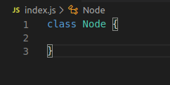

# Binary Tree Tutorial

## Introduction
This project's purpose is to teach new programmer’s the binary tree data structure. For those who aren’t familiar with a binary tree, it's a tree data structure with hierarchical relationships. A common usage of trees are folders with each having a collection of additional folders and/or files. When we open our download or a program folder in the local disk these are examples of trees. Before we begin learning please have the following prerequisite and coding environment set up. 

## Prerequisite 
    To maximize your understanding of the materials here are the following things needed:
    * Basic knowledge of Git commands
    * Basic knowledge of terminal commands (e.g. Windows, Mac OSX, Linux) 
    * VSCode (or any code editors that you’re familiar with)
    * Latest Node.js installed on the your computer/laptop 
    * Basic understanding of constructor functions and methods
    * Basic understanding of an object. 
    * Basic understanding of the concept “this”.

## Installation

### Forking the repository

    1. Open your terminal and type “git --version” without quotes.
        - If the terminal returns “git version 2.25.1.windows/mac/linux.1” or equivalent you can proceed with the installation process.
        - If the the terminal doesn’t return the proper result above please install git before proceeding
    2. On the github repository “fork” the repository into your personal repo

        *Caution*: If you would like to save your own work within your repository it's recommended to fork over git cloning. Under git clone by pushing changes from your folder this would alter the original repository. 
        - Check the repository for the project and find the “Clone or Download” button.
        -  Once clicked the button will show a link; copy the link.
        -  In the terminal enter the command “git clone” then paste the link.
        - iv. After pressing enter, a folder of master should appear in the folder.

### Check Node.js versions 
    1. Open a new terminal.
    2. In the terminal check if Node.js is installed by typing “node --version” and then “npm --version”.
    3. If the terminal returns “v.12.16.1” and “6.13.4” or the latest version of node and/or NPM, proceed to the next step.
    4. If the terminal does not return anything then node the version has not yet been installed.
    5. Install Node.js (Skip to the next step if have already installed).

### Installing Node.js
 ### Windows

    1. To install Node on Windows please visit the link and download recommended users
    2. Once the exe file has been downloaded go to the download folder.
    3. Once the file is found click the file to install the Node files. 
    4. Follow the instructions from the  to complete the installation.
    5. Revisit step 2 of the process to check node and npm has been installed.

### Mac OSX

    1. To install Node on Mac OSX check to see if you have home brew by typing “which brew”
    2. The terminal should return “/usr/local/bin/brew” confirming that brew is installed.If so proceed to the next step.
    3. If not please install brew using this following guide (https://docs.brew.sh/Installation):
        - Revist step one of by confirming that brew has been installed.
        - If successful type in “brew install node” without quotes..
        - Revisit step 2 of the process to check node and npm has been installed.

### Linux

    1. To install Node on Linux check to see if you have NVM (Node Version Manager) by typing “nvm --version”.
    2. If the terminal returns “0.34.0” or the latest proceed to the next step. 
    3. If not copy and paste the following code without quotes, "curl -o- https://raw.githubusercontent.com/nvm-sh/nvm/v0.35.3/install.sh | bash":
        - Revisit step one to confirm that NVM has been installed. 
        - If successful, type in “nvm install node” without quotes.
        - Revisit step 2 of the process to check node and npm has been installed.
    4. Opening the project with a code editor
    5. With a code editor find the project folder at the directory that it is located. 

## Basic Tree Properties

The node branches from its parent to its children containing a key and a value. In every parent node contains two children nodes with the left child containing a value lesser than its parent while the right child contains a larger value. The tree establishes itself with this hierarchy sorting the node’s based on its value. If the node value is lesser than the parent node it will travel to the left node containing values lesser than itself. If the node is greater than its parent node, it will travel to the right node until it finds a node greater than it. Nodes cannot share the same value causing it to overwrite the existing branch. 

The tree needs two of the following: a node and a binary search tree class. The node acts as a template storing distinct data inside of its branch; while the binary search tree contains methods of how data are returned.  Please follow the implementation guide below:

### Implementing a Node:

    

    1. Declare a class with the name “Node”.
    <!-- 

 -->
    2. Within the Node class create a constructor method:
    3. The constructor will accept one argument naming it “val”.
    4. Within the constructor’s scope declare and initialize three variables:
        - value (e.g. this.value = val)
        - left (e.g. this.left = null)
        - right (e.g. this.right = null)
    

### Implementing a Binary Search Tree:

    1. Declare a class with the name “BST”.
    2. Within the BST class create a constructor method:
        - The constructor will accept no arguments.
    3. Within the constructor scope declare and initialize one variable:
        - root (e..g this.root = null)
    4. Declare a new variable called tree:
        - Once done, create a new BST instance (e.g. new BST() ).  

By the end of this phase we have created two classes to begin creating the foundation of the tree. 

## Inserting Data into the Binary Tree

With both classes created we can now move onto creating methods to insert data into the tree. The tree itself contains nothing or null which gives a fresh start. Once we insert the root of the tree this will then predetermine how each node passed in is sorted. If we were to initialize the tree’s root with the key value of 50, any nodes with a lesser value than the root will be sorted to the left; meanwhile, anything bigger than the root will be sorted to the right. This operation doesn’t just merely stop from one edge to another, it will continue to check existing nodes to place the new node. Whether the new node has the is bigger or lesser than the child node it will initialize either left or right of that child node. 

When inserting data into a tree it's important to remember: no nodes can contain duplicates. Each node from its parents or childrens cannot contain the same key value to prevent a branch from being overwritten. 

### Implementing Insert Method:

    1. In the BST class create a method called “insert”.

    2. The insert method will accept one argument that is passed through it. 

    3. Declare a variable called “newNode” and “currNode”:
        - Initialize the variable by creating a new “Node” instance and pass the argument into its parameter. 
        - Initialize the “currNode” variable with the current root’s value (e.g. this.root).

    4. Check to see if the binary tree has a root:
        - If the root’s value is null, initialize the root's value with the “newNode”:
            - Then return the object using "this".
        - Create a while-loop:
            - Within the loops statement, pass in “currNode.value” to verify that the current node is not empty and/or null.
            - Create an if-statement whether the argument value is similar to the current node return “It already exists” with quotes. 
            - Create an if-else statement to compare the argument and the current node:
                - If the argument’s value is less than the current node’s value:
                    - Check if the left node is empty and if it is initialize the left node with the argument. Then end the method by returning “this”. 
            - Otherwise re-assign the current node with the left child node (e..g currNode.left) 
            - Else if the argument is bigger than the root:
                - Check to see if the right node is empty if it is initialize the right node with argument. Then end the method by returning “this”.
                - Otherwise re-assign the current node with the right child node (e.g. currNode.right).

We can now pass in values into the tree by simply calling insert from tree (e.g. tree.insert(10)). Try inserting your own value with the method. To verify if the value that you inserted exists we can create another method called “find”. 

## Implementing Find Method

    1. In the BST class create a method called “find”:
        - The find method will accept one argument that is passed through it.
        - In the find method, declare a variable called “currNode” and initialize it with the root; while the other variable called “found” and initialize it with the boolean value “false”. 

    2. Create a while-loop:
        -  Within the loop statement, pass in “currNode” and “!found” if the value has been found within the tree.
        - If the argument equals the current node’s value, re-assign the “found” variable to “true” to end the loop. 
        - If the argument is less than the current node’s value, re-assign “currNode” by traversing the left child node. 
        - If the argument is bigger than the current node’s value, re-assign “currNode” by traversing the right child node. 

    3. Create a if-else statement:
        - If found is equal to true return “currNode”.
        - Otherwise return “Does not exist” with quotes. 

With the find method, we can now find values within the tree to verify that it exists. Like the insert method, the find method can now be called from the tree variable. 

## Searching and Returning Data in the Binary Tree

Now that we are able to create our own tree we can move onto other methods to search for datas. Each method has its own algorithms of how data can be returned. This is important in real life applications where it acts as a way to show data such as files in order. 

## Pre-Order Traversal
In pre-order traversal, the current node is visited before any children nodes. After visiting the current node it will then traverse nodes from the root to left and right order. It will continue to visit each children node from this order until there is none. 

## Implementing in BST

    1. In BST class create a method called “preOrder”:
        - The “preOrder” method will accept two arguments:
            - One parameter should pass in the root value.
            - Second parameter should pass a default array (e.g. data = [])
        
    2. Create an if statement:
        - Within the statement, check to see if the node isn’t null:
            - Create two if statement:
                - Push the current node’s value into the default array. 
                - Check if the current node has a left property:
                    - If it does call the “preOrder” method passing in the current node left property and the default array. 
                - Check if the current node has a right property:
                    - If it does call the “preOrder” method passing in the current node right property and the default array. 
    
    3. Once the loop is done return the default array containing all values. 

With the “preOrder” method done we can now call it with the tree variable. The pre-order traversal method should return the values in a none orderly fashion. Remember the behavior of the traversal goes from the root-left-right. The method stores the value first into the array then recursively calls the method again until there are no more node’s to visit. 

## In-Order Traversal
In in-order traversal, the left node is visited before the root and the right node. After visiting the left node it will then traverse the root then to the right node. This will return all values in from an ascending order left to right. 

## Implementing in BST

    1.  In BST class create a method called “inOrder”:
        - The “inOrder” method will accept two arguments:
            - One parameter should pass in the root value.
            - Second parameter should pass a default array (e.g. data = [])
        
    2.  Create an if statement:
        - Within the statement, check to see if the node isn’t null..
        - Create two if statement:
            - Check if the current node has a left property:
                - If it does call the “inOrder” method passing in the current node left property and the default array. 
                - Push the current node’s value into the default array. 
            - Check if the current node has a right property:
                - If it does call the “inOrder” method passing in the current node right property and the default array. 
    3. Once the loop is done return the default array containing all values. 

The in-order traversal should return the values from an ascending order. The traversal for this method goes from left-root-right finding the lowest value first from the left branch. By the time there aren’t any node’s to explore from the left branch it will pivot itself to the middle then to the right branch. 

## Post-Order Traversal
In post-order traversal, the left and right branches are visited before the root. The method visits the bottom most children first before traversing upwards to the branch. Until the method visits all nodes of both branches the last node to be visited is the root. 

### Implementing in BST

    1. In BST class create a method called “postOrder”:
        - The “preOrder” method will accept two arguments:
            - One parameter should pass in the root value.
            - Second parameter should pass a default array (e.g. data = [])

    2. Create an if statement:
        - Within the statement, check to see if the node isn’t null..
        - Create two if statement:
            - Check if the current node has a left property:
                - If it does call the “postOrder” method passing in the current node left property and the default array. 
            - Check if the current node has a right property:
                - If it does call the “postOrder” method passing in the current node right property and the default array. 
            - Push the current node’s value into the default array. 

    3. Once the loop is done return the default array containing all values. 

The post-order method should return values in an order for each node it has visited from a left-right-root order. Unlike the other traversal methods that we have done so far, the method finds the bottom results of both branches. Until there are no branches left to travel upward the root will be pushed at the last element of the array.  

## Conclusion

This is the end of this tutorial. By now you should have familiarity on how to construct a binary tree and implementing search methods to retrieve values from each node. If you would like to practice more 